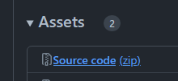
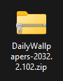
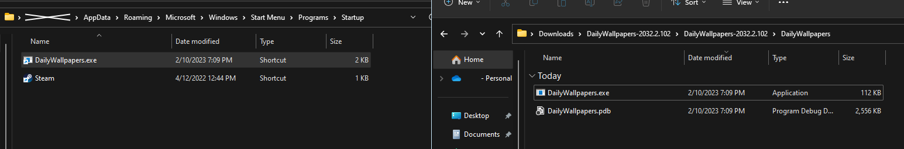

# DailyWallpapers

Console application that checks Bing's api for new daily images, and sets them as desktop wallpapers.

## Table of Contents

1. [How To Install](#how-to-install)
2. [Adding to Startup](#adding-to-startup)
3. [Info](#info)

## How To Install

Simple and easy installation. Head over to <a href="https://github.com/aisyshk/DailyWallpapers/releases/latest">the latest release</a> and download the `Source code (zip)`.

Once downloaded, unzip the `DailyWallpapers-xxxx.x.xx.zip`, open it until you reach the folder with the `.exe`

 

## Adding to Startup

If you'd like, move the `DailyWallpapers` folder to your `C:/` drive or your desktop. Open the folder with the `.exe` and create a shortcut to the `.exe`.

To add it to startup, press `Windows Key` + `R`, then type `shell:startup`. Drag and drop the shortcut you made into the startup folder.

And that's it! You've downloaded and set the app to run on startup.

## Info

There might be a chance that the Windows Anti-Virus deletes the file under the false threat of 'Trojan' virus. I assure you the program does nothing harmful, as you can see from the code in the <a href="https://github.com/aisyshk/DailyWallpapers/tree/master">master branch</a>.
